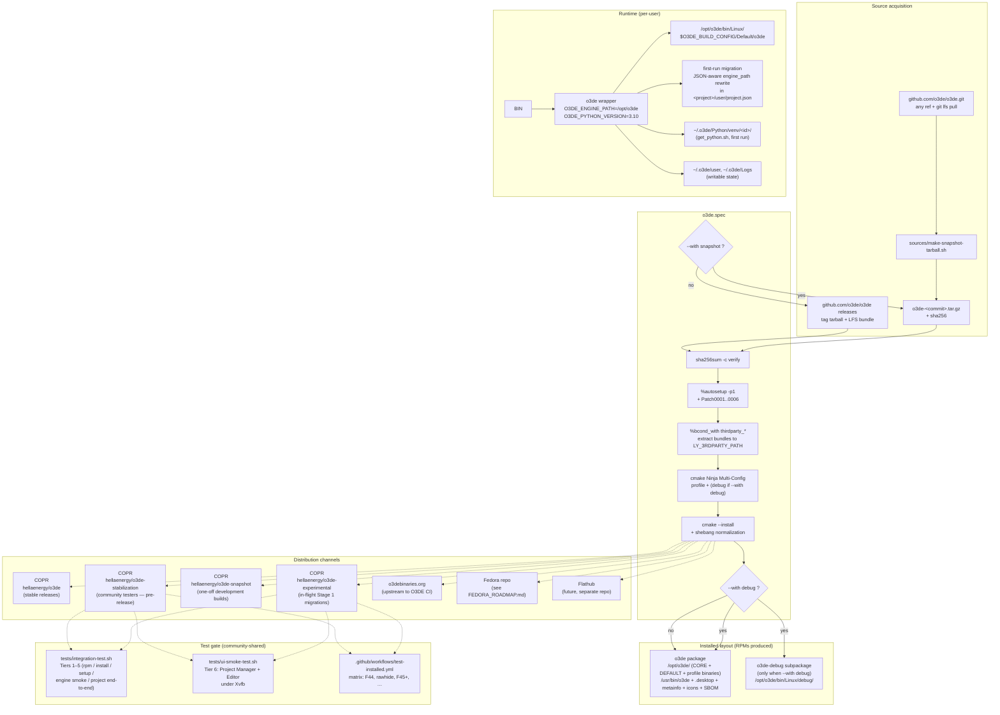

# Architecture

How `o3de.spec` turns the upstream Open 3D Engine source into a Fedora-installable RPM, and how that RPM behaves once installed. Intended audience: packaging contributors, reviewers evaluating the Fedora-inclusion request, and anyone debugging an unexpected build or runtime behavior.

For repo layout (which file goes where) see [`README.md`](README.md). For the per-bundle Fedora-readiness assessment see [`BUNDLED_LIBRARIES.md`](BUNDLED_LIBRARIES.md). For the staged plan to inclusion see [`FEDORA_ROADMAP.md`](FEDORA_ROADMAP.md).

## Five separations to notice

1. **Source-mode toggle** decides between a stable tarball and a reproducible snapshot tarball, but the rest of the spec is identical for both.
2. **3rdParty bundle toggles** are independent of source mode — each `--with thirdparty_<pkg>` extracts its `Source10x` tarball into `LY_3RDPARTY_PATH` before configure.
3. **System-library swap toggles** (Stage 1, Fedora-inclusion track) — each `--with system_<lib>` activates a Patch000N gate plus a `Find<lib>-system.cmake` stub, replacing one bundled 3rdParty package with its system equivalent. Independent of all other toggles. See [`BUNDLED_LIBRARIES.md`](BUNDLED_LIBRARIES.md) for status.
4. **Read-only engine + writable user state** — `/opt/o3de` is owned by root, all writable state lives in `~/.o3de/`. The launcher wrapper is the only piece that bridges them.
5. **One spec, multiple distribution channels** — the same spec produces the binary for four COPR projects (`o3de` stable / `o3de-stabilization` community-tester / `o3de-snapshot` one-off dev builds / `o3de-experimental` in-flight migration), the upstream submission to o3debinaries.org, and (eventually) Fedora; the future Flatpak shares ~80% of the source tree (patches, launcher, snapshot helper) but uses its own manifest. The channel marker baked into the GUI version string (`-stabilization.<commit>`, `-snapshot.<commit>`, `-experimental.<commit>`, or none for stable) lets testers identify which channel a build came from at a glance.
