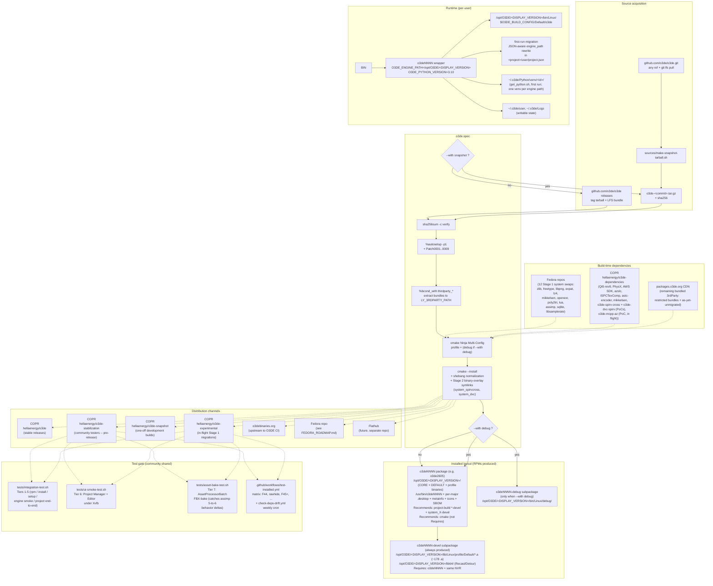

# Architecture

How `o3de.spec` turns the upstream Open 3D Engine source into a Fedora-installable RPM, and how that RPM behaves once installed. Intended audience: packaging contributors, reviewers evaluating the Fedora-inclusion request, and anyone debugging an unexpected build or runtime behavior.

For repo layout (which file goes where) see [`README.md`](README.md). For the per-bundle Fedora-readiness assessment see [`BUNDLED_LIBRARIES.md`](BUNDLED_LIBRARIES.md). For the staged plan to inclusion see [`FEDORA_ROADMAP.md`](FEDORA_ROADMAP.md).

## Seven separations to notice

1. **Source-mode toggle** decides between a stable tarball and a reproducible snapshot tarball, but the rest of the spec is identical for both.
2. **3rdParty bundle toggles** are independent of source mode -- each `--with thirdparty_<pkg>` extracts its `Source10x` tarball into `LY_3RDPARTY_PATH` before configure.
3. **System-library swap toggles** (Stage 1, Fedora-inclusion track) -- each `--with system_<lib>` activates a Patch000N gate plus a `Find<lib>-system.cmake` stub, replacing one bundled 3rdParty package with its system equivalent. Independent of all other toggles. See [`BUNDLED_LIBRARIES.md`](BUNDLED_LIBRARIES.md) for status.
4. **Read-only engine + writable user state** -- `/opt/O3DE/<version>/` is owned by root, all writable state lives in `~/.o3de/`. The launcher wrapper is the only piece that bridges them.
5. **One spec, multiple distribution channels** -- the same spec produces the binary for four COPR projects (`o3de` stable / `o3de-stabilization` community-tester / `o3de-snapshot` one-off dev builds / `o3de-experimental` in-flight migration), the upstream submission to o3debinaries.org, and (eventually) Fedora; the future Flatpak shares ~80% of the source tree (patches, launcher, snapshot helper) but uses its own manifest. The channel marker baked into the GUI version string (`-stabilization.<commit>`, `-snapshot.<commit>`, `-experimental.<commit>`, or none for stable) lets testers identify which channel a build came from at a glance.
6. **Versioned multi-install (postgresql-style at the package level; upstream-aligned at the engine level)** -- the spec parameterizes `Name:` as `o3deNNNN` (e.g. `o3de2605` for 26.05.x, `o3de2610` for the next major, derived from the spec's `stable_tag` macro) and the install prefix as `/opt/O3DE/<DISPLAY_VERSION>/` (matching upstream's `.deb` and Windows `.msi` exactly). Bumping `stable_tag` automatically produces the next major's package name and path with no other changes. Two majors install side-by-side on disk: `dnf install o3de2605 o3de2610` lands at `/opt/O3DE/26.05.0/` and `/opt/O3DE/26.10.0/` with no overlap; per-engine venvs in `~/.o3de/Python/venv/<engine-id>/` stay isolated automatically because cmake's `CalculateEnginePathId` hashes the engine root path. Subpackages (`o3deNNNN-debug`, `o3deNNNN-devel`) inherit the versioning via the standard `%{name}-debug` shorthand. **`engine.json`'s `engine_name` field is intentionally NOT versioned** -- it stays `"o3de"` (matching upstream's `.deb` default) so third-party gems' `compatible_engines` lists resolve correctly. The manifest at `~/.o3de/o3de_manifest.json` keys engine registrations by `engine_name`, so simultaneous active registration is single-slot -- users switch between installed majors via `scripts/o3de.sh register --this-engine`. Cross-major upgrades are NOT automatic -- different majors are different engine lines; users opt in explicitly.
7. **Three-source build-time dependency graph** -- Stage 1 system swaps pull from Fedora repos directly (12 active as of 2026-05-08: zlib, freetype, libpng, expat, lz4, mikkelsen, openexr, poly2tri, lua, assimp, sqlite, libsamplerate). Custom-rebuilt deps that aren't in Fedora live in the [`hellaenergy/o3de-dependencies`](https://copr.fedorainfracloud.org/coprs/hellaenergy/o3de-dependencies/) COPR project: 9 production deps (Qt 5.15-rev9 with O3DE patches, PhysX 5.x, AWS SDK 1.11.361, azslc, ISPCTexComp, astc-encoder, mikkelsen, etc.) plus the Stage 2 binary-only PoCs `o3de-spirv-cross` (✓ green 2026-05-07), `o3de-dxc-spirv` (✓ green 2026-05-08), and `o3de-mcpp-az` (in flight 2026-05-08). All license-clean (Apache/BSD/MIT) but not packaged in Fedora proper, COPR-rebuilt as license-clean SRPMs for redistribution. Restricted bundles (NvCloth's NVIDIA license, squish-ccr's BC7 patent encumbrance) and the few engine deps not yet covered by either path (OpenSSL, openimageio-opencolorio, pyside2, vulkan-validationlayers per `tools/check-deps-drift.py`'s gap report) continue to flow from `packages.o3de.org`'s CDN at cmake-config time (requires `enable_net=true` on the COPR engine projects). Each Stage 1 swap that lands shifts one bundle from path #3 (CDN) -> path #1 (Fedora). Each Stage 2 PoC that lands in `o3de-dependencies` shifts one bundle from path #3 -> path #2. The endgame is path #3 holding only the genuinely-restricted bundles. Drift between paths is monitored by `tools/check-deps-drift.py` (weekly GHA cron at `.github/workflows/check-deps-drift.yml`) which posts a sticky issue on detected mismatches.
