# Architecture

How `o3de.spec` turns the upstream Open 3D Engine source into a Fedora-installable RPM, and how that RPM behaves once installed. Intended audience: packaging contributors, reviewers evaluating the Fedora-inclusion request, and anyone debugging an unexpected build or runtime behavior.

For repo layout (which file goes where) see [`README.md`](README.md). For the per-bundle Fedora-readiness assessment see [`BUNDLED_LIBRARIES.md`](BUNDLED_LIBRARIES.md). For the staged plan to inclusion see [`FEDORA_ROADMAP.md`](FEDORA_ROADMAP.md).

```mermaid
flowchart TB
    subgraph SRC["Source acquisition"]
        S1["github.com/o3de/o3de releases<br/>tag tarball + LFS bundle"]
        S2["github.com/o3de/o3de.git<br/>any ref + git lfs pull"]
        SH["sources/make-snapshot-tarball.sh<br/>(git clone + git lfs pull + tar;<br/>LFS pull is load-bearing --<br/>GitHub archive endpoint strips it)"]
        S2 --> SH --> SNAP["o3de-&lt;commit&gt;.tar.gz<br/>+ sha256"]
    end

    subgraph DEPS["Build-time dependencies"]
        DPK1["Fedora repos<br/>(Stage 1 system swaps:<br/>zlib, freetype, libpng, expat, lz4,<br/>mikkelsen, openexr, poly2tri, lua,<br/>assimp, sqlite, libsamplerate,<br/>googlebenchmark, vulkan-validation-layers,<br/>xxhash, rapidjson (F44/rawhide only))"]
        DPK2["COPR<br/>hellaenergy/o3de-dependencies<br/>(Qt5-rev9, PhysX, AWS SDK, azslc,<br/>ISPCTexComp, astc-encoder, mikkelsen,<br/>o3de2605-spirv-cross + o3de2605-dxc-spirv + o3de2605-mcpp-az<br/>(Stage 2 3-pack) + o3de2605-cityhash (Stage 1 swap, lib not in Fedora);<br/>o3deNNNN-<dep> naming))"]
        DPK3["packages.o3de.org CDN<br/>(remaining bundled 3rdParty:<br/>restricted (NvCloth, squish-ccr) +<br/>libtiff (exception draft) +<br/>blocked-stage-3 (OIIO/OCIO, pyside2) +<br/>blocked-stage-4 (OpenSSL) +<br/>remaining multiplatform deps<br/>(RapidXML (walked back, AZ fork),<br/>pybind11, glad))"]
    end

    subgraph SPEC["o3de.spec"]
        BC{"--with snapshot ?"}
        SHA["sha256sum -c verify"]
        AUTO["%autosetup -p1<br/>+ Patch0001..0013 (default 13 applied)<br/>(6 TIMEBOMB: 0001/0002/0005/0007/0008/0012)<br/>--with development_snapshot -> 7 applied<br/>(gates the 6 merged-upstream)"]
        TP["%bcond_with thirdparty_*<br/>extract bundles to LY_3RDPARTY_PATH"]
        BUILD["cmake Ninja Multi-Config<br/>profile + (debug if --with debug)"]
        INST["cmake --install<br/>+ shebang normalization<br/>+ Stage 2 binary-overlay symlinks<br/>(system_spirvcross, system_dxc)<br/>+ Stage 2 library-link (system_mcpp)"]
        DBG{"--with debug ?"}
        BC -->|no| S1
        BC -->|yes| SNAP
        S1 --> SHA
        SNAP --> SHA
        SHA --> AUTO --> TP --> BUILD --> INST
        INST --> DBG
        DPK1 -.-> BUILD
        DPK2 -.-> BUILD
        DPK3 -.-> BUILD
    end

    subgraph INSTALL["Installed layout (RPMs produced)"]
        MAIN["o3deNNNN package (e.g. o3de2605)<br/>/opt/O3DE/&lt;DISPLAY_VERSION&gt;/ (CORE + DEFAULT + profile binaries)<br/>/usr/bin/o3deNNNN + per-major .desktop + metainfo + icons + SBOM<br/>Recommends: project-build *-devel + system_X-devel<br/>Recommends: cmake (not Requires)"]
        DEVELPKG["o3deNNNN-devel subpackage<br/>(always produced)<br/>/opt/O3DE/&lt;DISPLAY_VERSION&gt;/lib/Linux/profile/Default/*.a (~178 .a)<br/>/opt/O3DE/&lt;DISPLAY_VERSION&gt;/lib64/ (Recast/Detour)<br/>Requires: o3deNNNN = same NVR"]
        DBGPKG["o3deNNNN-debug subpackage<br/>(only when --with debug)<br/>/opt/O3DE/&lt;DISPLAY_VERSION&gt;/bin/Linux/debug/"]
        DBG -->|no| MAIN
        DBG -->|yes| MAIN
        MAIN --> DEVELPKG
        DBG -->|yes| DBGPKG
    end

    subgraph RT["Runtime (per-user)"]
        WRAP["o3deNNNN wrapper<br/>O3DE_ENGINE_PATH=/opt/O3DE/&lt;DISPLAY_VERSION&gt;<br/>O3DE_PYTHON_VERSION=3.10"]
        MIG["first-run migration<br/>JSON-aware engine_path rewrite<br/>in &lt;project&gt;/user/project.json"]
        PY["~/.o3de/Python/venv/&lt;id&gt;/<br/>(get_python.sh, first run; one venv per engine path)"]
        UD["~/.o3de/user, ~/.o3de/Logs<br/>(writable state)"]
        ENG["/opt/O3DE/&lt;DISPLAY_VERSION&gt;/bin/Linux/<br/>$O3DE_BUILD_CONFIG/Default/o3de"]
        BIN --> WRAP --> ENG
        WRAP --> MIG
        WRAP --> PY
        WRAP --> UD
    end

    subgraph DIST["Distribution channels"]
        DC1A["COPR<br/>hellaenergy/o3de<br/>(stable: tracks tagged<br/>upstream releases;<br/>see POST_RELEASE.md)"]
        DC1T["COPR<br/>hellaenergy/o3de-testing<br/>(pre-promotion soak for stable;<br/>Fedora updates-testing semantics;<br/>main HEAD -> ~48h soak -> stable)"]
        DC1B["COPR<br/>hellaenergy/o3de-stabilization<br/>(community testers --<br/>pre-release validation;<br/>active during stab/&lt;X&gt; windows)"]
        DC1S["COPR<br/>hellaenergy/o3de-development<br/>(tracks o3de/o3de:development;<br/>ad-hoc cadence)"]
        DC1C["COPR<br/>hellaenergy/o3de-experimental<br/>(in-flight Stage 1 migrations)"]
        DC2["o3debinaries.org<br/>(upstream to O3DE CI)"]
        DC3["Fedora repo<br/>(see FEDORA_ROADMAP.md)"]
        DC4["Flathub<br/>(future, separate repo)"]
        INST -.-> DC1A
        INST -.-> DC1T
        INST -.-> DC1B
        INST -.-> DC1S
        INST -.-> DC1C
        INST -.-> DC2
        INST -.-> DC3
        INST -.-> DC4
        DC1T -.->|"promote after soak"| DC1A
    end

    subgraph TEST["Test gate (community-shared)"]
        T1["tests/integration-test.sh<br/>Tiers 1-5 (rpm / install / setup /<br/>engine smoke / project end-to-end)"]
        T2["tests/ui-smoke-test.sh<br/>Tier 6: Project Manager + Editor<br/>under Xvfb"]
        T4["tests/asset-bake-test.sh<br/>Tier 7: system-swap library-health<br/>(SONAME + symbol + linkage smoke<br/>across the Stage 1 + Stage 2 swaps, incl. cityhash)"]
        T5["tests/ap-spawn-smoke-test.sh<br/>Tier 8: AP+builder runtime smoke<br/>(catches process-lifecycle bugs)"]
        T6["tests/multiplayersample-build-test.sh<br/>Tier 9: full MultiplayerSample build<br/>+ AP batch + launcher-load smoke<br/>(all 4 targets: GameLauncher,<br/>ServerLauncher, HeadlessServer,<br/>bare gem; opt-in; ~60-90 min cold,<br/>~3-10 min warm)"]
        T7["tests/newspaper-delivery-build-test.sh<br/>Tier 10: NewspaperDeliveryGame<br/>build + bake + playable-game smoke<br/>(opt-in; ~30-60 min cold,<br/>~3-10 min warm)"]
        T8["tests/post-load-liveness-test.sh<br/>Tier 11: post-load liveness smoke<br/>(launcher survives N seconds<br/>after LEVEL_LOAD_END without<br/>crash/freeze; opt-in; ~60-90 s)"]
        T3[".github/workflows/test-installed.yml<br/>matrix: F44, rawhide, CS10, F45+, ...<br/>+ check-deps-drift.yml weekly cron"]
        DC1B -.-> T1
        DC1B -.-> T2
        DC1B -.-> T4
        DC1B -.-> T5
        DC1B -.-> T6
        DC1B -.-> T7
        DC1B -.-> T3
        DC1C -.-> T1
        DC1C -.-> T2
        DC1C -.-> T4
        DC1C -.-> T5
        DC1C -.-> T6
        DC1C -.-> T3
    end
```



## Eight separations to notice

> **Distro coverage.** Builds run on three chroots: **F44** (the primary production target), **fedora-rawhide** (the next Fedora), and **CentOS Stream 10** (upstream of RHEL 10). Each brings a different toolchain, which is what most of the chroot-specific handling exists for: rawhide ships Lua 5.5, so the `LUA_VERSION_NUM >= 505` patches fire only there, and CS10's older RPM 4.19 parser drives spec conventions like escaping `%%install` in comments. The running CS10 toolchain-compat list is in the `project_cs10_engine_build_blockers` memory note.

1. **Source-mode toggle** decides between a stable tarball and a reproducible snapshot tarball, but the rest of the spec is identical for both.
2. **3rdParty bundle toggles** are independent of source mode; each `--with thirdparty_<pkg>` extracts its `Source10x` tarball into `LY_3RDPARTY_PATH` before configure.
3. **System-library swaps** (Stage 1, the Fedora-inclusion track). Each `--with system_<lib>` swaps one bundled 3rdParty package for its Fedora equivalent, independent of every other toggle. See "How a Stage 1 system-library swap resolves" below for the mechanism, and [`BUNDLED_LIBRARIES.md`](BUNDLED_LIBRARIES.md) for current per-library status.
4. **Read-only engine, writable user state.** `/opt/O3DE/<version>/` is owned by root; all writable state lives in `~/.o3de/`. The launcher wrapper is the only bridge between them.
5. **One spec, many channels.** The same spec feeds five COPR channels (`o3de` stable, `o3de-testing` pre-promotion soak, `o3de-stabilization` community-tester, `o3de-development` dev-branch, `o3de-experimental` in-flight migration), the eventual o3debinaries.org upstream submission, and Fedora itself; a future Flatpak reuses most of the tree with its own manifest. A channel marker in the GUI version string (`-stabilization`, `-development.<commit>`, `-experimental.<commit>`, or empty for stable and testing) tells a tester which channel a build came from at a glance.
6. **Versioned multi-install.** The package name (`o3deNNNN`, e.g. `o3de2605`) and the install prefix (`/opt/O3DE/<DISPLAY_VERSION>/`) are both derived from the spec's `stable_tag`, matching upstream's `.deb` and Windows `.msi` layout. Bumping `stable_tag` yields the next major's name and path with no other change, and two majors install side by side (`dnf install o3de2605 o3de2610`) with no overlap; per-engine venvs stay isolated because cmake hashes the engine root path. The `-debug` and `-devel` subpackages inherit the versioning. One deliberate exception: `engine.json`'s `engine_name` stays `"o3de"` (not versioned, matching upstream's `.deb`) so third-party gems' `compatible_engines` lists still resolve. The user manifest keys registrations by that name, so only one major is the active engine at a time (switch with `scripts/o3de.sh register --this-engine`), and cross-major upgrades are never automatic, different majors are different engine lines.
7. **Three-source dependency model.** Every build-time 3rdParty dependency comes from exactly one of three places, and the migration work is about moving dependencies between them:

   * **Fedora system packages** (path 1), reached by the Stage 1 system swaps.
   * **The `hellaenergy/o3de-dependencies` COPR** (path 2), our license-clean rebuilds of things that aren't in Fedora proper (Stage 2; named `o3deNNNN-<dep>`). Two shapes: a binary the engine shells out to (e.g. spirv-cross, dxc), or a library the engine links (e.g. mcpp).
   * **The `packages.o3de.org` CDN** (path 3), everything still bundled, fetched at cmake-config time (so the COPR engine projects need `enable_net=true`).

   A Stage 1 swap moves a dependency from path 3 to path 1; a Stage 2 rebuild moves it from path 3 to path 2. The endgame leaves path 3 holding only the genuinely restricted bundles (NvCloth's NVIDIA license, squish-ccr's BC7 patent encumbrance). Current per-dependency placement and Fedora-readiness live in [`BUNDLED_LIBRARIES.md`](BUNDLED_LIBRARIES.md); drift between the three paths is watched by the weekly `check-deps-drift.yml` cron, which files a sticky issue on any mismatch.

8. **Versioned dependency packages.** Our `o3de-dependencies` Stage 2 packages are named `o3deNNNN-<dep>` (e.g. `o3de2605-spirv-cross`), with NNNN matching the engine major, so `o3de2605` and a future `o3de2610` coexist without ABI skew. This mirrors both Fedora's own postgresql10 family and upstream's CDN, which is a single store of versioned keys rather than a store per major. `Obsoletes`/`Provides` on the unversioned name keep existing `Requires` resolving across upgrades. Stage 1 system swaps are *not* renamed; they use Fedora-conventional names that Fedora versions by SONAME. The full rationale, and the per-major-project layout we considered and rejected, is in the `project_o3de_3p_versioning_research` memory note.

## How a Stage 1 system-library swap resolves

The mechanism has two halves: the engine's lazy 3rdParty resolution, and our gate-plus-shim that redirects it to a system library.

**Baseline (no swap).** `ly_associate_package(PACKAGE_NAME X-x.y-rev1 TARGETS X ...)` in `cmake/3rdParty/Platform/Linux/BuiltInPackages_linux_x86_64.cmake` does NOT download anything. It only registers a global `LY_PACKAGE_ASSOCIATION_X` property (`cmake/3rdPartyPackages.cmake`). Resolution is lazy: the first time a target declares a `3rdParty::X` build dependency and `X` is not yet a target, the engine (`cmake/3rdParty.cmake`) runs `ly_download_associated_package(X)` to fetch the prebuilt, then `find_package(X REQUIRED MODULE)`. So `find_package` is always reached; the prebuilt download just precedes it.

**With the swap (`--with system_X`, which passes `-DLY_USE_SYSTEM_X=ON`).** Patch0006 (plus the gem-local Patch0009 / Patch0013) wraps each associate line:

```cmake
if (NOT LY_USE_SYSTEM_X)
    ly_associate_package(PACKAGE_NAME X-x.y-rev1 TARGETS X ...)
else()
    find_package(X REQUIRED)
endif()
```

With the flag on, the prebuilt is never registered; `find_package(X)` runs eagerly at the BuiltInPackages site and creates the `3rdParty::X` target from the system library. Because the target then exists, the lazy path above is later skipped.

**The shim satisfies `find_package(X)`.** We ship the find module as `sources/Find<X>-system.cmake` and copy it at `%prep` to `cmake/3rdParty/Find<X>.cmake` (the canonical name; the `-system` suffix is only our source-tree label). `cmake/3rdParty` is on `CMAKE_MODULE_PATH`, so `find_package(X)` resolves our module ahead of cmake's stock one. For libraries cmake already ships a module for (ZLIB, TIFF, Freetype, PNG, Lua), ours mostly delegates to the stock module and adds the `3rdParty::X` alias; a few (mikkelsen, expat, lua) bridge include paths or header-case on top.

**Two consumption patterns.** The above is the **prebuilt-package** path (`ly_associate_package`), which requires the gate patch because the associate line is what we have to intercept. The other pattern is **FetchContent** gems, which do `list(APPEND CMAKE_MODULE_PATH .../3rdParty)` then call `find_package(openmesh)` themselves, lazily, and only when the gem is enabled. Those can be swapped with NO patch: prepend a directory containing our `Find<X>.cmake` to `CMAKE_MODULE_PATH` and the gem's own `find_package` picks it up. As upstream migrates 3rdParty from prebuilt to FetchPackage (assimp already did, o3de/o3de#19365), those swaps become patch-free.

**Direction.** A single central guard on the lazy resolver, `if (NOT LY_USE_SYSTEM_${pkg}) ly_download_associated_package(...) endif()` in `cmake/3rdParty.cmake`, would make the prebuilt path patch-free and lazy too: distros would set `-DLY_USE_SYSTEM_<X>=ON` and drop a `Find<X>.cmake` on the module path, with no per-line BuiltInPackages patches and no over-eager resolution of gem-only libraries. This is an active upstream conversation (sig-build).
