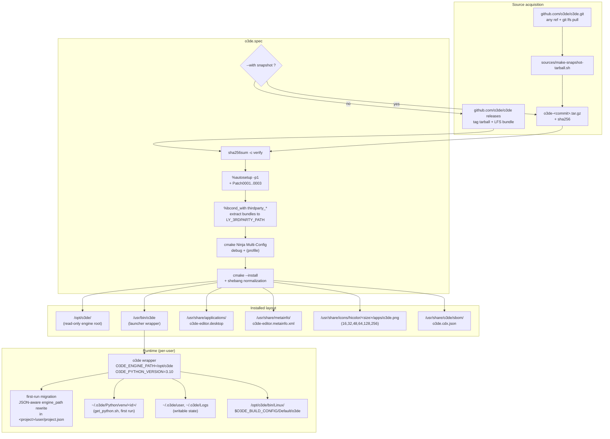

# o3de-rpm

RPM packaging for the [Open 3D Engine](https://o3de.org), targeting **Fedora 44** with **rpm 4.20+**.

The same spec produces:

- **Stable release builds** — from upstream's tagged release tarball (`o3de_<tag>_lfs.tar.gz`).
- **Development snapshot builds** — from any git ref of `o3de/o3de`, for testing the `development` branch or arbitrary pre-release commits.

It also provides an extension point for bundling pre-built **O3DE 3rdParty packages** into the RPM, gated by per-package `--with` flags so you only pay for what you use.

---

## Layout

```
o3de-rpm/
├── o3de.spec                                          # the spec
├── README.md                                          # this file
├── Makefile                                           # lint / srpm / copr targets
├── .github/workflows/lint.yml                         # CI: spec parse, rpmlint, validators
└── sources/                                           # rpm SOURCES dir (sources + patches)
    ├── o3de-launcher.sh                               # /usr/bin/o3de wrapper
    ├── o3de-editor.desktop                            # .desktop entry
    ├── o3de-editor.metainfo.xml                       # AppStream metainfo
    ├── o3de.cdx.json                                  # CycloneDX SBOM
    ├── make-snapshot-tarball.sh                       # snapshot builder
    ├── icons/                                         # hicolor app icons
    │   └── o3de-{16,32,48,64,128,256}x*.png
    ├── 0001-clang21-warning-suppressions.patch
    ├── 0002-manifest-py-engine-path-detection.patch
    └── 0003-get-python-sh-rpm-venv-fixes.patch
```

`rpmbuild` reads sources from `_sourcedir`, so build invocations point both `_sourcedir` and `_specdir` at this checkout — no copying into `~/rpmbuild/SOURCES`.

---

## Architecture



Three separations to notice:

1. **Source-mode toggle** decides between a stable tarball and a reproducible snapshot tarball, but the rest of the spec is identical for both.
2. **3rdParty toggles** are independent of source mode — each `--with thirdparty_<pkg>` extracts its `Source10x` tarball into `LY_3RDPARTY_PATH` before configure.
3. **Read-only engine + writable user state** — `/opt/o3de` is owned by root, all writable state lives in `~/.o3de/`. The launcher wrapper is the only piece that bridges them.

---

## Build a stable release

```bash
# 1. Compute the upstream tarball SHA256 (one-time per release).
TAG=2510.2
curl -fLO "https://github.com/o3de/o3de/releases/download/${TAG}/o3de_${TAG}_lfs.tar.gz"
sha256sum "o3de_${TAG}_lfs.tar.gz"
# Paste the hex into o3de.spec under %global stable_sha256.
mv "o3de_${TAG}_lfs.tar.gz" sources/

# 2. Build.
rpmbuild -bb \
    --define "_sourcedir $PWD/sources" \
    --define "_specdir   $PWD" \
    o3de.spec
```

---

## Build a development snapshot

```bash
# 1. Generate a reproducible snapshot tarball + checksum.
cd sources
./make-snapshot-tarball.sh development      # or any git ref / commit sha
cd ..

# 2. Paste the printed snapshot_commit / snapshot_date / snapshot_sha256
#    into the corresponding %global lines in o3de.spec.

# 3. Build.
rpmbuild -bb --with snapshot \
    --define "_sourcedir $PWD/sources" \
    --define "_specdir   $PWD" \
    o3de.spec
```

The snapshot version string is `<stable_tag>^<YYYYMMDD>git<shortsha>` (e.g. `2510.2^20260427gitabc1234`). The `^` separator tells `dnf` this is a *pre-release* of the next release, so upgrading `snapshot → next-stable` works correctly.

---

## Build with O3DE 3rdParty packages bundled

The engine fetches its `LY_3RDPARTY_PATH` packages from O3DE's package server during cmake configure by default. To make the RPM self-contained for an offline target, drop the bundle tarball into `sources/` and pass `--with thirdparty_<name>`.

The spec ships two example toggles (`physx`, `openexr`); add more by:

1. Drop the package tarball in `sources/`, e.g. `physx-5.1.1-rev1-linux.tar.xz`.
2. Add a `%bcond_with thirdparty_<name>` line.
3. Add a matching `Source10x: <filename>` line.
4. Add an extract line in `%prep`:
   ```
   %{?with_thirdparty_<name>:tar -xf %{SOURCE10x} -C %{_builddir}/%{o3de_source_dir}/3rdParty}
   ```

Then build with any subset of toggles:

```bash
rpmbuild -bb --with thirdparty_physx --with thirdparty_openexr \
    --define "_sourcedir $PWD/sources" \
    --define "_specdir   $PWD" \
    o3de.spec
```

The full list of approved package names and revisions lives in O3DE's `cmake/3rdParty/Platform/Linux/BuiltInPackages_linux_x86_64.cmake`.

---

## Build the debug-only configuration

For faster iteration during development:

```bash
rpmbuild -bb --with debug_only ...
```

Skips the `profile` configuration entirely — both build and install steps.

---

## Distribution

This repo ships RPMs through two COPR projects under the same owner:

- **[`hellaenergy/o3de-dependencies`](https://copr.fedorainfracloud.org/coprs/hellaenergy/o3de-dependencies/)** — Fedora-clean SRPMs for O3DE 3rdParty packages that aren't in Fedora proper (custom Qt 5.15-rev9, PhysX, AWSNativeSDK, azslc, …). `enable_net=false`. Built first — depended on by the next one.
- **[`hellaenergy/o3de`](https://copr.fedorainfracloud.org/coprs/hellaenergy/o3de/)** *(stable)* and **[`hellaenergy/o3de-snapshot`](https://copr.fedorainfracloud.org/coprs/hellaenergy/o3de-snapshot/)** *(development branch)* — the engine itself. `enable_net=true` so cmake can still fetch the four restricted bundles from `packages.o3de.org` (DXC, NvCloth, poly2tri, squish-ccr) — those four cannot be redistributed via Fedora/COPR for licensing reasons.

To consume:

```bash
sudo dnf copr enable hellaenergy/o3de-dependencies
sudo dnf copr enable hellaenergy/o3de            # stable
# OR
sudo dnf copr enable hellaenergy/o3de-snapshot   # development
sudo dnf install o3de
/opt/o3de/python/get_python.sh                   # one-time per-user venv setup
o3de                                             # launch
```

To publish from this checkout:

```bash
make snapshot REF=stabilization/26050   # generate tarball + print pin values
$EDITOR o3de.spec                       # paste the printed snapshot_* macros
make copr-snapshot                      # builds SRPM, uploads to hellaenergy/o3de-snapshot
make copr-stable                        # for stable releases
```

A `make copr-init` target prints the one-time setup commands for the COPR project. Run `make help` for the full target list.

CI (`.github/workflows/lint.yml`) runs spec-parse + rpmlint + desktop-file-validate + appstream-util validate on every push, against a Fedora 44 container. The full RPM build is too heavy for free runners (>2 hours, 14 GB output) — the COPR projects do that.

---

## Security posture

| Concern | Mitigation |
|---|---|
| Tampered upstream tarball | `%prep` verifies `Source0` against `%global stable_sha256` (or `snapshot_sha256`) with `sha256sum -c` before extraction. |
| Tampered snapshot | `make-snapshot-tarball.sh` is reproducible (sorted, fixed mtime, numeric owner) — re-running for the same commit produces a byte-identical tarball. The committed sha256 is the binding root of trust. |
| World-writable files under `/usr` | Removed. `/opt/o3de` is fully read-only after install; all writable state is per-user under `~/.o3de/`. |
| Network during build | LFS objects are bundled into the source tarball before build; no `git lfs pull` runs in `%build`. O3DE's own `LY_PACKAGE_SERVER_URLS` 3rdParty fetcher still runs at cmake configure unless every needed package is pre-bundled — see "3rdParty packages" above. |
| **⚠ Bundled OpenSSL 1.1.1t (EOL since 2023-09-11)** | Not our packaging defect — upstream O3DE pins it. Surfaced here so consumers see it clearly. Migration to system OpenSSL 3.x is non-trivial (1.1 → 3.x is a major API break across multiple O3DE Gems). |
| Hardening flags (RELRO / BIND_NOW / stack-protector / `_FORTIFY_SOURCE`) | Restored explicitly via `CMAKE_*_LINKER_FLAGS_INIT` after unsetting Fedora's CFLAGS/CXXFLAGS/LDFLAGS bundle (the bundle's annobin specs file breaks clang feature tests). O3DE's `Configurations_clang.cmake` already supplies stack-protector and `_FORTIFY_SOURCE`. |
| Runtime escalation paths | Launcher wrapper is `/usr/bin/o3de`, mode 0755, no setuid. All `mkdir -p` targets are under `$HOME`. |
| Patch reviewability | Real `.patch` files with `From:`/`Subject:` rationales — reviewable with `git log` or `interdiff`. |
| Source provenance auditability | CycloneDX 1.6 SBOM at `/usr/share/o3de/sbom/o3de.cdx.json` documents every bundled component, with purl, license expression, and EOL flags where applicable. |
| First-run state migration | Launcher's `<project>/user/project.json` rewrite is JSON-aware (`python3 -c json.load/dump`), only mutates known legacy prefixes, and is gated by a per-prefix marker file. Failures are silenced so a malformed home dir can't block the editor. |

---

## SBOM

A static CycloneDX 1.6 JSON SBOM is committed at `sources/o3de.cdx.json` and shipped as part of the RPM at `/usr/share/o3de/sbom/o3de.cdx.json`. It documents:

- The package itself (`pkg:rpm/fedora/o3de@<version>-<release>`) with its license expression and source URLs.
- Build dependencies (cmake, ninja-build, gcc-c++, python3-devel, git-lfs).
- Direct runtime dependencies (Qt5, Vulkan, mesa, libcurl, openssl, …).
- Bundled components (custom Qt 5.15-rev9, embedded clang toolchain, bundled Python — version follows the spec's `%global o3de_bundled_python` macro, currently 3.10, plus pyside2/shiboken2, OpenEXR, OpenImageIO, OpenColorIO, PhysX, etc.) — explicitly distinguished from system deps.
- **EOL flags** for bundled OpenSSL 1.1.1t.

To consume:

```bash
# After install:
cyclonedx validate --input-file /usr/share/o3de/sbom/o3de.cdx.json

# Generate a runtime augmentation from the actual built RPM:
syft /opt/o3de -o cyclonedx-json
```

Re-generate the static SBOM when bumping the version: edit `sources/o3de.cdx.json` to update `metadata.component.version`, the `version` field at the top level, and any external references.

---

## Patches

Applied via `%autosetup -p1`:

| # | File | Purpose |
|---|---|---|
| 0001 | `cmake/Platform/Common/Clang/Configurations_clang.cmake` | Add `-Wno-error=deprecated-volatile` and `-Wno-error=character-conversion` so clang 21+ doesn't fail O3DE's `-Werror` build. |
| 0002 | `scripts/o3de/o3de/manifest.py` | Honor `O3DE_ENGINE_PATH` env var for engine-root detection when the o3de Python package is installed inside a venv. |
| 0003 | `python/get_python.sh` | After per-user venv creation, link `engine.json`/`o3de` site-packages into the venv, reconcile the engine-id mismatch between get_python.sh and the O3DE binary, and refresh the patched `manifest.py` into the venv. |

Each patch carries a `From:`/`Subject:` header with the rationale.

---

## Known limitations

- O3DE's 3rdParty package fetcher still runs at cmake configure unless every package is pre-bundled. Fully hermetic offline builds (mock without network) require staging every package the engine pulls.
- Four upstream-bundled packages (`DirectXShaderCompilerDxc`, `NvCloth`, `poly2tri`, `squish-ccr`) cannot be hosted in Fedora or COPR for licensing reasons. They continue to be fetched from O3DE's package CDN at build time.
- Bundled OpenSSL 1.1.1t is end-of-life. Migration to system OpenSSL 3.x is a major engineering effort.
- `debuginfo` / `debugsource` subpackages are suppressed (`%global debug_package %{nil}`). Debug symbols are present in the binaries but not extracted into a separate package.

## License

This packaging is `Apache-2.0 OR MIT` to match upstream O3DE. The packaging files (`o3de.spec`, `sources/*`, `patches/*`) are dedicated under the same dual license.
